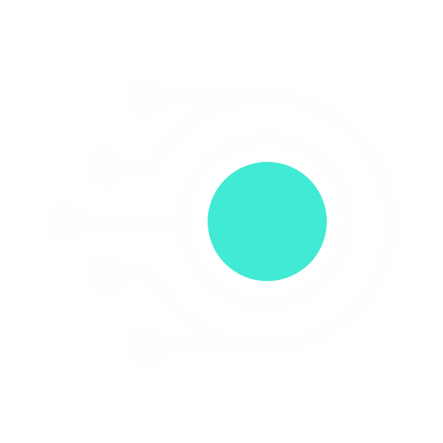

# Squidly2519 Developer Portfolio



This is the official developer portfolio for **Squidly2519**, showcasing projects, skills, and experience as a software developer at SAPHI Engineering.

## 🎨 Features

* **Dark Mode Design** using custom color palette
* **Responsive Layout** that works on desktop, tablet, and mobile
* **Skills Section** with categorized tech stack
* **Projects Showcase** with interactive hover animations
* **Experience Timeline** showing career journey
* **Quotes & Recommendations** from peers and collaborators
* **Smooth Animations** (scrolling, fades, and typing effects)

## 🖼 Color Palette

* Background: `#171717`
* Primary Accent: `#41ead4`
* Secondary Accent: `#c0b8dd`
* Text: `#fdfffc`
* Muted Text: `#a6a6a6`

## 🚀 Getting Started

1. Clone the repository:

```bash
git clone https://github.com/Squidly2519/portfolio.git
```

2. Open `index.html` in your favorite browser.

## 📂 Project Structure

```bash
portfolio/
├── index.html          # Main website file
├── style.css           # Styling (Dark Mode, Animations)
├── script.js           # JavaScript for animations & interactivity
└── images/
    └── logo.png        # Portfolio logo
```

## 🔧 Customization

* Update `index.html` to modify text, projects, or quotes.
* Adjust `style.css` for colors, spacing, or typography.
* Edit `script.js` to change animations or add new features.

## 📜 License

This project is licensed under the MIT License. Feel free to use and modify for your own portfolio.

---

💻 **Created by Squidly2519** | 🚀 Powered by passion for code

